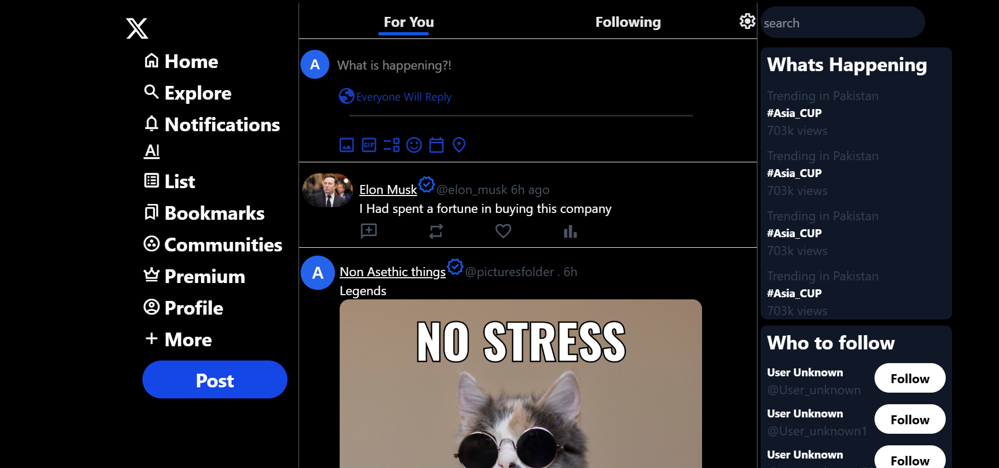

# Project Clone

This clone was created using the **Tailwind CSS** framework. I learned a lot about the framework and really enjoyed building this project. This project also helped me gain a deeper understanding of development concepts and provided an excellent opportunity to practice and sharpen my skills.

---

## 🚀 Features

- **Responsive Design:** Works seamlessly across all screen sizes.
- **Optimized UI:** Smooth, modern, and user-friendly interface.
- **Photo Section:** Showcase images in an attractive layout.
- **Link Section:** Includes important links for navigation or references.

---

## 🛠️ Technologies & Languages Used

- **HTML5**  
- **Tailwind CSS**

---

## 📷 Screenshots


<div style="display: flex; gap: 10px; flex-wrap: wrap;">
  
  
</div>

---

## 📂 Installation

1. Clone the repository:
   ```bash
   git clone https://github.com/Asmar255/TWITTER-X-CLONE.git
